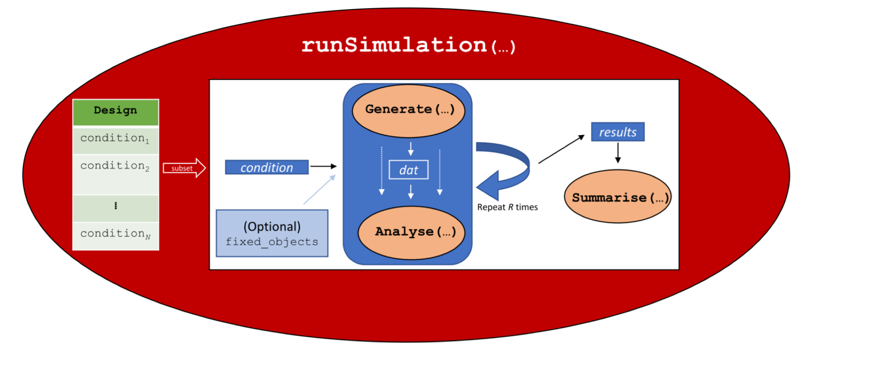

This repository is aimed at myself. My goal is to explore how the R SimDesign package might be useful for me in doing parameter recovery simulations. I also want to learn how it might be integrated into my existing tech stack and workflow.

## Log

### Standard R Project Setup

Create local repository

```bash
mkdir repos/simdesign-test
cd repos/simdesign-test
git init
```

Create and push to remote repository via CLI

```bash
gh repo create
```

(follow terminal prompts)

Add README.md

```bash
touch README.md
```

(add initial Readme content)

Create an initial commit

```bash
git add .
git commit -m "Initial commit"
git push
```

Initialize `renv` 

```r
renv::init()
q()
```

Adapt `.Rprofile` to deal with VS Code better (creates RENV settings I like and makes sure to load my user `.Rprofile` before the project `.Rprofile`; this is necessary because VS Code requires some extra settings and packages to work well with R):

```bash
echo '
Sys.setenv(
  RENV_CONFIG_RSPM_ENABLED = FALSE,
  RENV_CONFIG_SANDBOX_ENABLED = FALSE
)

if (requireNamespace("rprofile", quietly = TRUE)) {
  rprofile::load(dev = quote(reload()))
} else {
  source("renv/activate.R")
}
' > .Rprofile
```

followed by 

```
renv::snapshot()
```

### Working with the SimDesign Package

#### Step 1: Generate a structural template for a generate-analyse-summarise workflow

The first recommendation in the tutorial is to use 

```r
SimDesign::SimFunctions()
```

to generate a template. Let's save it to a file:

```r
SimDesign::SimFunctions(file = "R/getting_started.R")
```

Note: this create a double `.R` extension. The package does not check if you already have an extension in the file name (so don't add `.R` to the file name):

```r
SimDesign::SimFunctions(file = "R/getting_started")
```

The output looks like this:

```r
#' --- 
#' title: "Simulation title"
#' output:
#'   html_document:
#'     theme: readable
#'     code_download: true
#' ---


#-------------------------------------------------------------------

library(SimDesign)

Design <- createDesign(factor1 = NA,
                       factor2 = NA)

#-------------------------------------------------------------------

Generate <- function(condition, fixed_objects) {
    dat <- data.frame()
    dat
}

Analyse <- function(condition, dat, fixed_objects) {
    ret <- nc(stat1 = NaN, stat2 = NaN)
    ret
}

Summarise <- function(condition, results, fixed_objects) {
    ret <- c(bias = NaN, RMSE = NaN)
    ret
}

#-------------------------------------------------------------------

res <- runSimulation(design=Design, replications=2, generate=Generate, 
                     analyse=Analyse, summarise=Summarise)
res

```

I am not a big fan of the capital letters in the function names but I'll deal with that later.

#### Step 2: Use `createDesign()` to create a design object

I'm not absolutely sure what a design is in this context, but it sounds like it might be a grid of parameters? The tutorial recommends using the following function and then editing the resulting Design object definition:

```r
createDesign()
```

I see that this is already present in the `getting_started.R` file. 

This looks just like an `expand.grid` wrapped in a tible:

```r
Design <- createDesign(a = c(1,2,3), b = c(2,5))
Design
#> # A tibble: 6 × 2
#>       a     b
#>   <dbl> <dbl>
#> 1     1     2
#> 2     2     2
#> 3     3     2
#> 4     1     5
#> 5     2     5
#> 6     3     5
```

The only difference seems to be the presence of an extra attribute `Design.ID` and that this object is of class `Design`. Is any of this necesary? I will setup a basic grid for testing the simple 2-parameter mixture model:

```r
Design <- createDesign(n = c(20, 50, 100),
                       pmem = c(0.3, 0.6, 0.9),
                       kappa = c(2, 8, 32))
```

#### Step 3: Edit the `Generate`, `Analyse`, and `Summarise` functions

I replaced them with functions for generating data from the 2-parameter mixture model, fitting the model via mixtur, and summarizing the correlation between the true and estimated parameters:

```r
library(SimDesign)
library(bmm)
library(mixtur) 

Design <- createDesign(n = c(20, 50, 100),
                       pmem = c(0.3, 0.6, 0.9),
                       kappa = c(2, 8, 32))

#-------------------------------------------------------------------

Generate <- function(condition, fixed_objects) {
    data.frame(
      response = bmm::rmixture2p(
        n = condition$n, 
        kappa = condition$kappa, 
        p_mem = condition$pmem
      ),
      target = 0,
      id = 1
    )
}

Analyse <- function(condition, dat, fixed_objects) {
  suppressMessages(
    mixtur::fit_mixtur(dat, model = "2_component", unit = "radians") |> 
      dplyr::select(kappa, p_t) |> 
      dplyr::rename(kappa_est = kappa, pmem_est = p_t)
  )
}

Summarise <- function(condition, results, fixed_objects) {
    list(
      corr = list(
        kappa = cor(condition$kappa, results$kappa_est),
        pmem = cor(condition$pmem, results$pmem_est)
      ),
      bias = list(
        kappa = mean(results$kappa_est - condition$kappa),
        pmem = mean(results$pmem_est - condition$pmem)
      ),
      rmse = list(
        kappa = sqrt(mean((results$kappa_est - condition$kappa)^2)),
        pmem = sqrt(mean((results$pmem_est - condition$pmem)^2))
      )
    )
}

#-------------------------------------------------------------------

res <- runSimulation(
  design = Design, replications = 2, generate = Generate,
  analyse = Analyse, summarise = Summarise
)
```

which... gives me an error

```
Error: Summarise() should not throw errors. Message was:
    Error in cor(condition$kappa, results$kappa_est) : 
  incompatible dimensions
```

I have misunderstood whne the Summarise function is applied. I thought it is used on the final results over the entire design grid. But the real workflow is like this:



Specifically, for a single row of the design grid, we get as many results from Analyze() as there are replications. Then Summarise() is applied to these results. This means that the `condition` object in Summarise() is a single row of the design grid, and I cannot compute the correlation between the true and estimated parameters as I did. I will need to do that **outside** of the runSimulation() call.

##### Interlude: Figure out the format of the arguments passed to Summarise

I don't quite understand what the format of the variables passed to Summarise is. I added the following two lines to the `Summarise` function:

```r
saveRDS(condition, "output/condition.rds")
saveRDS(results, "output/results.rds")
```

after running the script, I can inspect the files:

```r
readRDS('output/condition.rds')
#> # A tibble: 1 × 4
#>      ID     n  pmem kappa
#>   <int> <dbl> <dbl> <dbl>
#> 1    27   100   0.9    32
```

Thus the condition input is a tibble with a single row of the Design object (plus an extra variable ID). 

Now the results object. I wasn't sure what to expect, because the Analyse functio returns a data.frame with one row. Was I going to get a list of data.frames? Or a data.frame with multiple rows? 

```r
readRDS('output/results.rds') |> str()
#> 'data.frame':   2 obs. of  2 variables:
#>  $ kappa_est: num  37.5 28.6
#>  $ pmem_est : num  0.903 0.892
```

A data.frame with multiple rows it is. 


#### Look at the results of the toy example

Strange, when I call the resulting object from `runSimulation()` I get a tibble with some stats, but no results:

```r
#> # A tibble: 27 × 7
#>        n  pmem kappa REPLICATIONS SIM_TIME       SEED COMPLETED               
#>    <dbl> <dbl> <dbl>        <dbl> <chr>         <int> <chr>                   
#>  1    20   0.3     2            2 0.02s    1067494386 Mon Dec  2 07:12:04 2024
#>  2    50   0.3     2            2 0.02s    1016705019 Mon Dec  2 07:12:04 2024
#>  3   100   0.3     2            2 0.02s     722626823 Mon Dec  2 07:12:04 2024
#>  4    20   0.6     2            2 0.02s     831982255 Mon Dec  2 07:12:04 2024
#>  5    50   0.6     2            2 0.01s     768366952 Mon Dec  2 07:12:04 2024
#>  6   100   0.6     2            2 0.01s     304278543 Mon Dec  2 07:12:04 2024
#>  7    20   0.9     2            2 0.01s      65199313 Mon Dec  2 07:12:04 2024
#>  8    50   0.9     2            2 0.01s    1432496718 Mon Dec  2 07:12:04 2024
#>  9   100   0.9     2            2 0.01s    1874577138 Mon Dec  2 07:12:04 2024
#> 10    20   0.3     8            2 0.01s     516980583 Mon Dec  2 07:12:04 2024
#> # ℹ 17 more rows
#> # ℹ Use `print(n = ...)` to see more rows
```
